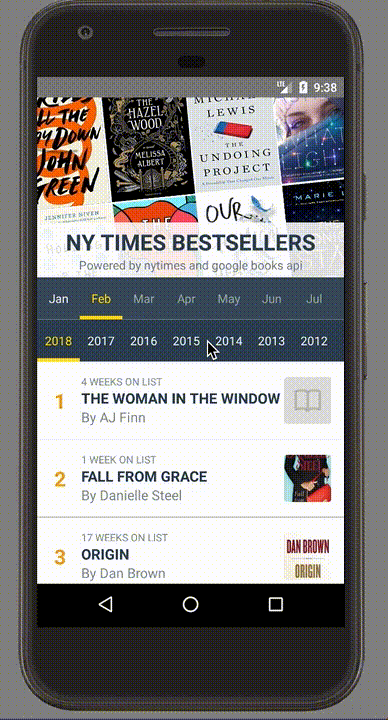

# NY TIMES BESTSELLER 
React Native and mobx-state-tree powered app to browse through the NY time best seller list

## Demo


## Getting Started

### Install from source

First, clone the project:

```bash
$ git clone https://github.com/shettypuneeth/nytimes-bestseller.git <my-project-name>
$ cd <my-project-name>
# Install the dependencies
$ yarn install
# OR
$ npm install
```

### Get the key for NY times and Google Books API service.

Get a NY Times API key from: https://developer.nytimes.com/signup
Get a Google Books API key: https://developers.google.com/books/docs/v1/using
  1. Open [Credentials Page](https://console.developers.google.com/apis/credentials?project=_)
  2. Create a new credential by choosing Create credentials and choose API key from the dropdown
  3. Go to the [API dashboard](https://console.developers.google.com/apis/dashboard) and Enable Google Books API service.

Then, open up app/config/environment.js file and update the `GOOGLE_BOOKS_API_KEY` and `NY_TIMES_API_KEY` with your api keys.

## Run the app

```bash
# Open the terminal in the root folder and run:
$ yarn start

# Open the respective Android or iOS projects in Android Studio or XCode and run the project.
```

## Acknowledgments
1. [`NY Times API`](https://developer.nytimes.com/) for all the books data.
2. [`Google Book API`](https://developers.google.com/books/) for book cover images.
3. [`react-native-parallax-scroll-view`](https://github.com/i6mi6/react-native-parallax-scroll-view) from [`Alexander Vitanov`](https://github.com/i6mi6)
4. [`react-navigation`](https://reactnavigation.org/) for routing.
5. [`mobx-state-tree`](https://github.com/mobxjs/mobx-state-tree) for state management.
6. [`styled-components`](https://www.styled-components.com/docs/basics#react-native) for styling.